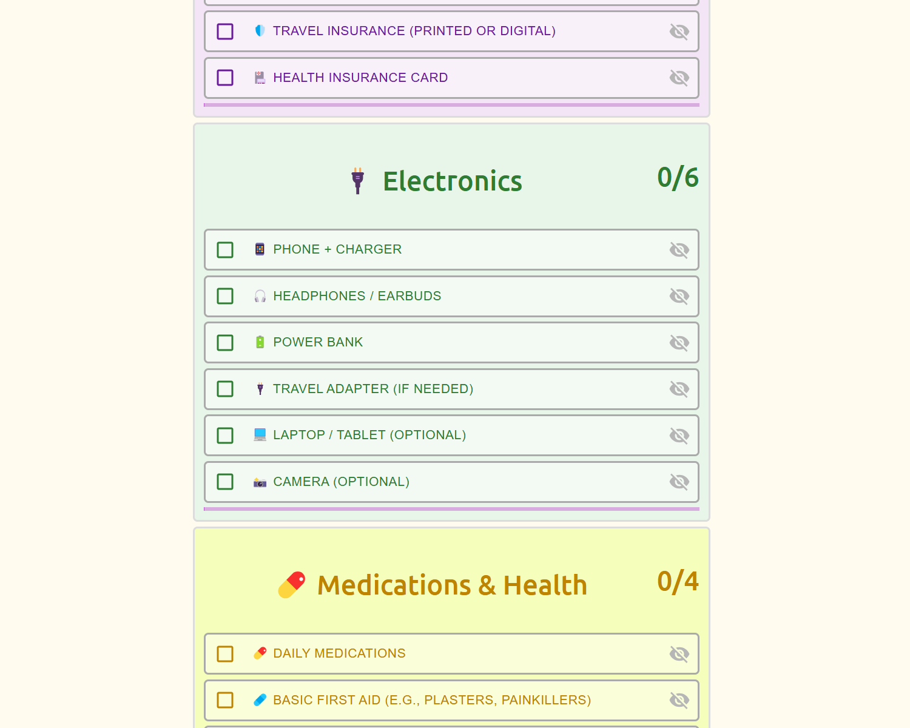

# 🛃 Simple Travel List



**A minimal example of using Material UI in a React list app.**

This project is a small demo showing how to build a checklist-style app using [Material UI](https://mui.com/) components within a React application. It serves as a simple example for managing state and UI in a list-based interface.

It is ideal for:
 - Beginners learning React and Material UI basics
 - Developers looking for a lightweight example of state management with lists
 - Anyone who wants a starter template for a checklist or travel packing app
 - The code is intentionally kept simple and readable, without any external state management libraries or complex build tools.

## 🌐 Live Demo

The app is hosted on 👉 [**GitHub Pages**](https://r3mus99.github.io/simple-travel-list/)

## 📅 Getting Started

To run the app locally, follow these steps:

```bash
npm install
npm start
Then visit http://localhost:3000 in your browser.
```

## 📂 Project Structure
- ```src/``` – Main source files
- ```App.js``` – Root component
- ```components/``` – Custom React components (e.g., Item, ItemList, etc.)
- ```index.js``` – Entry point for the React app

## 📊 Technologies Used
 - [React](https://react.dev/)
 - [Material UI](https://mui.com/material-ui/)
 - [Create React App](https://create-react-app.dev/docs/getting-started/)

## ✅ Features
 - Add items to a checklist
 - Toggle items as packed/unpacked
 - Clear all items from the list


Feel free to fork the project or submit issues if you'd like to contribute or suggest improvements!

